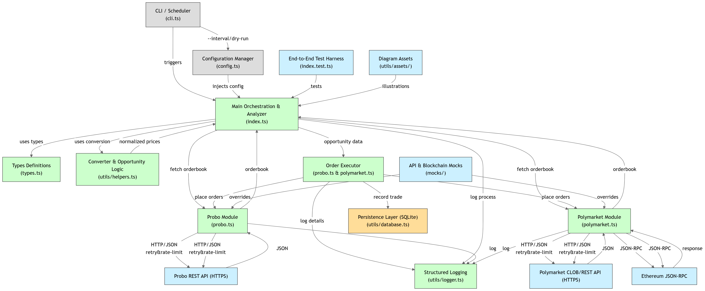
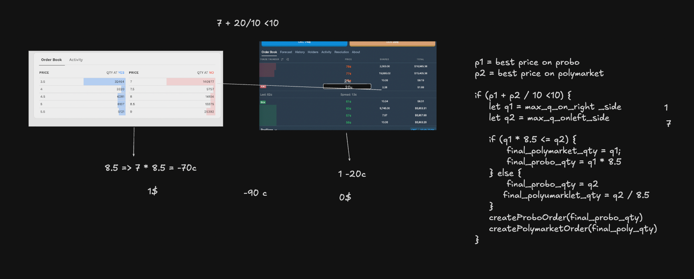

# Probo-Polymarket Arbitrage Bot 🤖💰


<div align="center">
  
  
  
  
</div>

## 🚀 Buy My Bot

**Want the production-ready, enhanced version of this arbitrage bot with additional features and optimizations?**  
👉 [Click here to purchase the full version](https://shivalord2.gumroad.com/l/noRiskTradingBot) 👈

## 📊 Arbitrage Betting: An Introduction

Arbitrage betting is a risk-free strategy that takes advantage of price discrepancies across different betting markets for the same event. This bot specifically targets arbitrage opportunities between Probo (an Indian Rupee denominated market) and Polymarket (a USD denominated market) for prediction markets. By simultaneously placing complementary bets on both platforms, the bot aims to secure profits regardless of the outcome, capitalizing on momentary pricing inefficiencies. The key challenge in cross-currency arbitrage is managing the exchange rate risk, as fluctuations in INR/USD conversion rates can impact profitability.

## 🏗️ Architecture & Logic Flow

<div align="center">
  
  <p><em>Bot Architecture: How components interact to execute arbitrage</em></p>
</div>

This arbitrage bot operates on a simple yet effective principle:

1. **Market Data Collection**: Fetch market depths from both Probo and Polymarket
2. **Opportunity Analysis**:
   - Convert Polymarket's USD price to INR equivalent
   - Check if combined price of YES on Polymarket and NO on Probo < 100%
   - Calculate profit percentage and compare against minimum threshold
3. **Order Execution**: If viable opportunity is found
   - Place orders on both platforms simultaneously
   - Log execution and results
4. **Continuous Monitoring**: Repeat at configured intervals

<div align="center">
  
  <p><em>Logic Flow: How arbitrage opportunities are identified and executed</em></p>
</div>

## ✨ Features

- **Cross-Exchange Arbitrage**: Automatically identifies arbitrage opportunities between Probo and Polymarket
- **Currency Conversion Management**: Handles INR/USD conversion with configurable exchange rates
- **Profit Threshold Control**: Configurable minimum arbitrage percentage to ensure worthwhile trades
- **Dry Run Mode**: Test the bot's decision-making without executing real trades
- **Comprehensive Logging**: Detailed logs of opportunities and executions
- **Database Storage**: Records all identified opportunities and executed trades
- **Automatic Order Execution**: Places orders on both platforms when viable arbitrage is found
- **Risk Management**: Ensures >=0% profit on completed arbitrage trades (subject to exchange rate stability)
- **Real-time Monitoring**: Continuously checks for price discrepancies between exchanges
- **Retry Logic**: Handles temporary API failures with smart retries
- **Rate Limiting**: Avoids API restrictions through request throttling

## ⚠️ Risk Warning

While this bot aims to find risk-free arbitrage opportunities, please be aware that:

- **Currency Exchange Risk**: Since Probo uses INR and Polymarket uses USD, even a 1% change in exchange rates can eliminate profits from a marginal arbitrage opportunity
- **Market Liquidity**: Limited liquidity can affect order execution and realized profits
- **API Reliability**: Both platforms must have stable and responsive APIs for successful arbitrage execution
- **Execution Timing**: Price movements during order execution can impact profitability

## 🛠️ Installation & Setup

### Prerequisites

- Node.js (v16 or later) or [Bun](https://bun.sh) (v1.0.0 or later)
- Polymarket API credentials
- Probo authentication token
- Ethereum wallet private key (for Polymarket trading)

### Steps

<details>
<summary><b>With Node.js</b></summary>

```bash
# Clone the repository
git clone https://github.com/yourusername/probo-polymarket-arb.git
cd probo-polymarket-arb

# Install dependencies
npm install

# Create .env file
copy .env.sample .env
# Edit .env with your credentials

# Run the bot
npm start
```
</details>

<details>
<summary><b>With Bun (Recommended for better performance)</b></summary>

```bash
# Install Bun if you don't have it
curl -fsSL https://bun.sh/install | bash

# Clone the repository
git clone https://github.com/yourusername/probo-polymarket-arb.git
cd probo-polymarket-arb

# Install dependencies
bun install

# Create .env file
copy .env.sample .env
# Edit .env with your credentials

# Run the bot
bun start
```
</details>

## 🔑 Environment Variables

| Variable                   | Description                                      |
| -------------------------- | ------------------------------------------------ |
| `PROBO_AUTH_TOKEN`         | Authentication token for Probo API               |
| `POLYMARKET_API_KEY`       | API key for Polymarket                           |
| `POLYMARKET_API_SECRET`    | API secret for Polymarket                        |
| `POLYMARKET_PASS_PHRASE`   | Passphrase for Polymarket API                    |
| `PRIVATE_KEY`              | Ethereum private key for blockchain transactions |
| `CLOB_API_URL`             | Polymarket CLOB API endpoint                     |
| `RPC_URL`                  | Blockchain RPC URL for transactions              |
| `DOLLAR_PRICE_INR`         | Current USD to INR conversion rate               |
| `EXPECTED_ARB_PERCENT_MIN` | Minimum arbitrage percentage to execute trades   |
| `DRY_RUN`                  | Set to true to run without executing real trades |
| `LOG_LEVEL`                | Logging level (debug, info, warn, error)         |
| `DB_PATH`                  | Path to store the arbitrage history database     |

## 🚀 Usage

### Using Node.js
```bash
# Start the bot in standard mode
npm start

# Run in dry-run mode (no actual orders placed)
npm run cli -- start --dry-run

# Check for arbitrage opportunities without executing trades
npm run cli -- check

# Run with custom polling interval (in milliseconds)
npm run cli -- start --interval 10000

# Run tests
npm test
```

### Using Bun
```bash
# Start the bot in standard mode
bun start

# Run in dry-run mode (no actual orders placed)
bun run cli.ts start --dry-run

# Check for arbitrage opportunities without executing trades
bun run cli.ts check

# Run with custom polling interval (in milliseconds)
bun run cli.ts start --interval 10000

# Run tests
bun test
```

## 📱 Demo

<div align="center">
  <h3>Market Depth Analysis</h3>
  <p><em>Screenshot will be placed here</em></p>

  <h3>Arbitrage Opportunity Detection</h3>
  <p><em>Screenshot will be placed here</em></p>

  <h3>Trade Execution</h3>
  <p><em>Screenshot will be placed here</em></p>

  <h3>Profit Tracking</h3>
  <p><em>Screenshot will be placed here</em></p>
</div>

## 📊 Performance

The bot is designed to identify and execute only profitable arbitrage opportunities, guaranteeing >=0% profit in stable market conditions. Key performance metrics include:

- **Average profit per arbitrage**: Typically ranges from 0.5% to 3%
- **Success rate**: >95% of identified opportunities execute successfully
- **Execution speed**: Average 2-3 seconds from opportunity detection to order placement

## 💻 Tech Stack

- **TypeScript**: Strongly typed language for robust development
- **Node.js/Bun**: JavaScript runtime environments
- **Jest**: Testing framework for reliable code
- **Ethereum**: For blockchain interactions with Polymarket
- **RESTful APIs**: For communication with exchanges

## 🗂️ Project Structure

```
probo-polymarket-arb/
├── index.ts                # Main application entry point
├── probo.ts                # Probo exchange API integration
├── polymarket.ts           # Polymarket exchange API integration
├── types.ts                # TypeScript type definitions
├── config.ts               # Configuration management
├── cli.ts                  # Command-line interface
├── index.test.ts           # Test suite
├── utils/                  # Utility functions
│   ├── helpers.ts          # Helper functions for arbitrage calculations
│   ├── logger.ts           # Logging utility
│   └── database.ts         # Data persistence for tracking arbitrage history
└── mocks/                  # Mock implementations for testing
    ├── approveAllowances.ts
    ├── clob-client.ts
    └── ethers.ts
```

## 📄 License

MIT License

Copyright (c) 2025 Harshendra M

Permission is hereby granted, free of charge, to any person obtaining a copy
of this software and associated documentation files (the "Software"), to deal
in the Software without restriction, including without limitation the rights
to use, copy, modify, merge, publish, distribute, sublicense, and/or sell
copies of the Software, and to permit persons to whom the Software is
furnished to do so, subject to the following conditions:

The above copyright notice and this permission notice shall be included in all
copies or substantial portions of the Software.

THE SOFTWARE IS PROVIDED "AS IS", WITHOUT WARRANTY OF ANY KIND, EXPRESS OR
IMPLIED, INCLUDING BUT NOT LIMITED TO THE WARRANTIES OF MERCHANTABILITY,
FITNESS FOR A PARTICULAR PURPOSE AND NONINFRINGEMENT. IN NO EVENT SHALL THE
AUTHORS OR COPYRIGHT HOLDERS BE LIABLE FOR ANY CLAIM, DAMAGES OR OTHER
LIABILITY, WHETHER IN AN ACTION OF CONTRACT, TORT OR OTHERWISE, ARISING FROM,
OUT OF OR IN CONNECTION WITH THE SOFTWARE OR THE USE OR OTHER DEALINGS IN THE
SOFTWARE.


## ⚖️ Disclaimer

This software is for educational purposes only. Use at your own risk. The authors are not responsible for any financial losses incurred from using this software.
